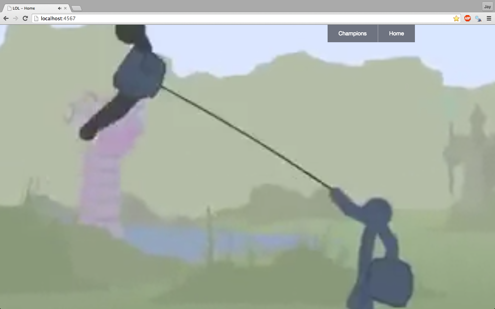
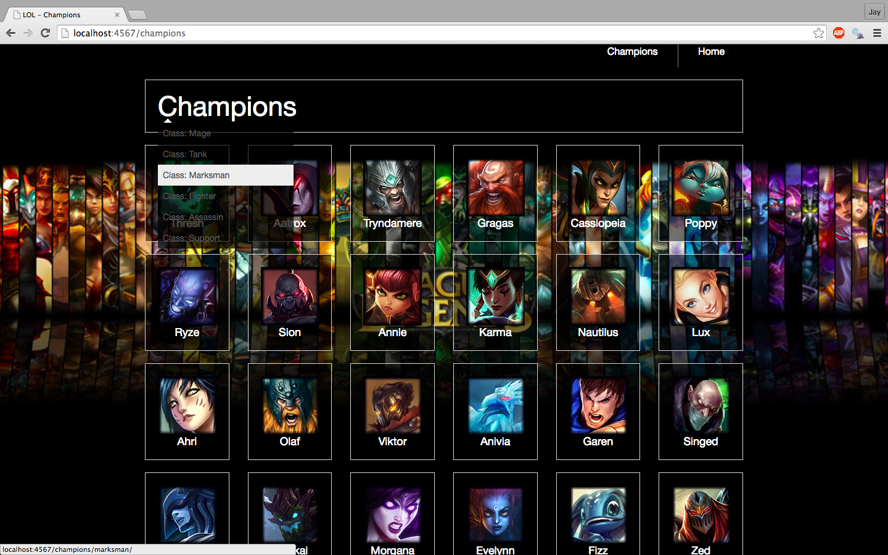
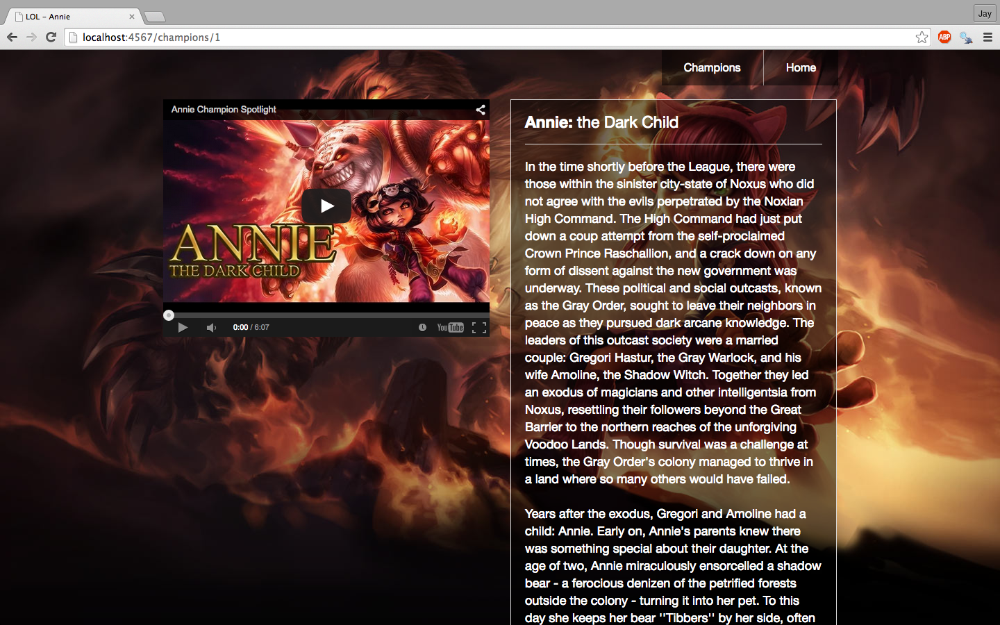

League of Legends is a web application listing champions and their associating lore and Youtube video

Here are some screenshots of League of Legends
[As of right not this application is in development as I made it in Sinatra and will slowly make the move to rails and add more features]

Home page: Is a video of stick figures of the champions

Champion List:

Champion Page:

You can git clone this project and create an .env file to put in your own League of Legends API and your own Google API to play around with.

Pre Dec 11, 2014
- played around with League of Legends API and through Sinatra framework started working on how to parse the API data that I was getting and started to iterate through the data, to show a list of champions and their lore

Dec 11, 2014
- already created the website without committing each step due to a lack of knowledge on how to use git
- cleaned up my the data I got through parsing the JSON to make it easier to iterate
Dec 12, 2014
- attacked some styling with the use of foundation

Dec 20, 2014
- some more styling to clean up the website

Dec 31, 2014
- added in routes for categories, while categorizing the champion list

Jan 1, 2015
- added a background video to the home page

Jan 3, 2015
- refactored code a bit
